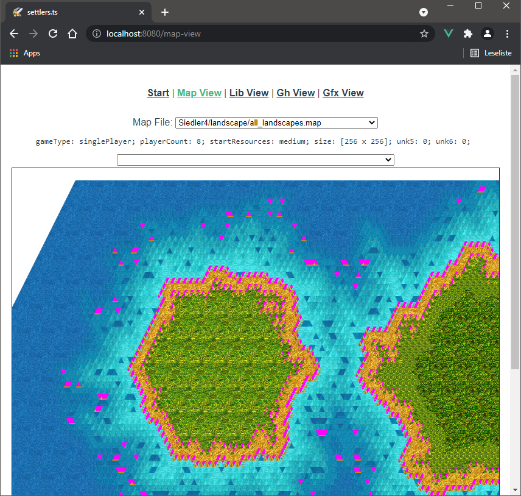
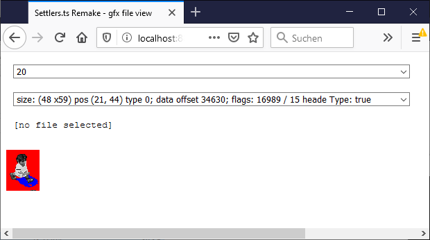
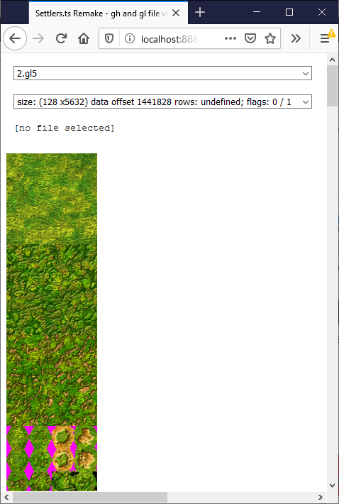
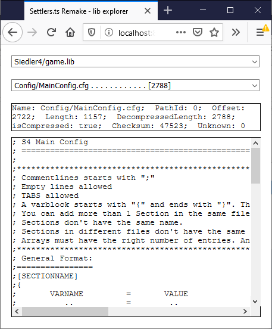
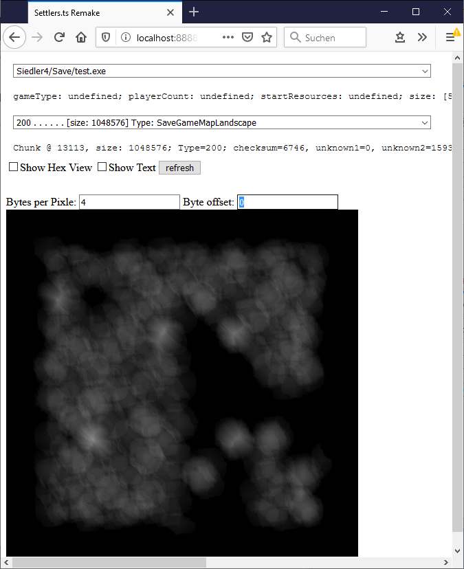

# Settlers 4 remake (File Formats)
This is a Settlers 4 (Siedler 4) Remake (it will be :-) ) written in JavaScript (Typescript) so 
  it can be run in your browser.
  

<a href="https://settlers.hmilch.net/">[explore the game]</a>

# How to compile:
1. Install [NodeJs](https://nodejs.org/)
2. run on command line:

        npm install
        npm run build

➜ This will create the `./dist/` folder with the app.

# How to start:
1. Install [NodeJs](https://nodejs.org/)
2. Copy the *Settlers-4*-game folder with the files (`game.lib`, `gfx.lib`, `Gfx/0.gfx`, ...) to the `/dist/` folder - e.g. to `./dist/Siedler4/`
3. Run `./dist/run.bat` \
   This will: 
   * create a list of all files in your e.g. `./dist/Siedler4/` folder.
   * start a local Webserver on your PC
4. Open: http://localhost:8888/

# How to edit:
You can use *Visual Studio Code* to edit and debug your code:
1. [Visual Studio Code](https://code.visualstudio.com/)
2. Install *Debugger for Chrome* Plugin in Visual Studio Code
3. Copy the *Settlers-4*-game folder to `./public/` e.g.  to `./public/Siedler4/`
4. run

        npm install
        npm run serve

    Or press `Ctrl+Shift+B` to start the live-server in VS-Code

    ➜ This will start a live-server on http://localhost:8080/

* Fix code style / linter errors

        npm run lint -- --fix

* Run unit tests

        npm run test:unit

# Next BIG steps:
1. using webGl to render the state of a game by loading a save game and pushing all data to webGl:
  see: https://jsfiddle.net/fsg2kw3o/

2. adding game logic to process state changing in the game
  see: `game.lib/objectInfo.xml` and `game.lib/buildingInfo.xml`
  see: https://github.com/jsettlers/settlers-remake

3. adding backend logic
  using websocket to communicate with local webserver. The webserver now can provide: 
   * Folder access to e.g. list all save games
   * Network access to allow network gaming

# State:

## Load/view a Map

View Landscape using WebGL

## View / decode file formats
You can access 'all' Settlers file formats

### gfx-file view:

### gl-file and gh-file view:

### lib-file view:

### map-file view:

# Disclaim
This Software reads the original graphics/data from the original *Settlers 4* title released by Blue Byte® - The authors of this Software do not clam any rights on any of that data nor the name *Siedler* and *Settlers*.
